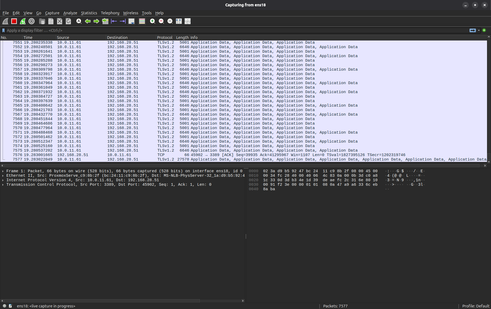

# Screenshot-Styleguide

Screenshots sind für diesen Kurs hilfreich, weil Wireshark ein visuelles Werkzeug ist. Viele Lernende verstehen Paketliste, Paketdetails, Filterleiste, Conversations, Expert Information oder I/O Graphs schneller, wenn sie sehen, worauf sie achten sollen.

Trotzdem gilt:

> Screenshots unterstützen die Analyse. Sie ersetzen sie nicht.

Ein guter Screenshot zeigt genau eine Aussage und verweist auf den dazugehörigen Text, Filter, Frame oder Befehl.

## Ziel

Dieser Styleguide legt fest:

- wann Screenshots sinnvoll sind
- welche Daten in Screenshots erlaubt sind
- welche Herkunfts- und Lizenzangaben nötig sind
- wo Bilder abgelegt werden
- wie Dateien benannt werden
- wie Screenshots eingebunden werden
- wie Alt-Texte geschrieben werden
- wie Markierungen verwendet werden
- wie Screenshots wartbar bleiben

## Grundsatz: eigene Screenshots aus sauberen Lab-Daten

Der Standardfall für dieses Repository ist:

> Screenshot selbst erstellen, mit eigenen Lab-Captures oder synthetischen Testdaten arbeiten und die Herkunft dokumentieren.

Erlaubt sind:

- selbst erzeugte Screenshots aus Wireshark oder TShark
- Docker-Labs aus diesem Repository
- synthetische Beispiel-Captures
- selbst erstellte Diagramme und Skizzen
- öffentliche Beispiel-Captures mit klarer Lizenz, wenn diese Lizenz die Nutzung erlaubt
- unkritische Testumgebungen ohne reale Betriebsdaten

Nicht erlaubt sind:

- produktive Unternehmens-Captures
- personenbezogene Daten
- echte Kundendaten
- echte Zugangsdaten
- interne Hostnamen aus produktiven Netzen
- Patientendaten oder medizinische Fachdaten
- reale Incident-Captures ohne ausdrückliche Freigabe
- Screenshots aus fremden Kursen, Büchern, Videos, Blogartikeln oder Folien ohne passende Lizenz oder Erlaubnis
- Logos, Zertifizierungsabzeichen oder Produktgrafiken als dekorative Elemente, wenn sie nicht ausdrücklich erlaubt sind

!!! warning "PCAPs und Screenshots können sensible Daten enthalten"
    Ein Screenshot kann DNS-Namen, IP-Adressen, Cookies, Tokens, Zertifikatsdetails, Benutzernamen oder interne Systemnamen zeigen. Vor dem Commit immer prüfen, ob der Screenshot wirklich veröffentlichbar ist.

## Rechte- und Quellenmodell

Für jeden Screenshot muss klar sein, woher er stammt und unter welcher Grundlage er verwendet wird.

| Fall | Verwendung im Kurs | Erforderliche Dokumentation |
|---|---|---|
| eigener Wireshark-Screenshot aus eigenem Lab | bevorzugt | Bildnachweis mit "eigener Screenshot", Lab-Name, optional Wireshark-Version |
| eigener TShark-/Terminal-Screenshot | erlaubt, wenn Textblock nicht besser ist | Bildnachweis mit "eigene Ausgabe", System/Lab-Kontext |
| eigenes Diagramm | erlaubt | Bildnachweis mit "eigene Darstellung" |
| öffentliches PCAP mit klarer Lizenz | möglich | Quelle, Lizenz, Abrufdatum, Änderungen, Link auf Original |
| fremder Screenshot aus Artikel, Video, Buch oder Kurs | grundsätzlich vermeiden | nur mit Lizenz/Erlaubnis; Quelle und Lizenz sichtbar dokumentieren |
| offizielles Logo, Badge, Zertifizierungslogo | vermeiden | nur verwenden, wenn Nutzungsrechte eindeutig geklärt sind |
| unklare Quelle oder unklare Lizenz | nicht verwenden | keine Ausnahme |

Für Wireshark-Screenshots gilt: Die Software darf im Kurs beschrieben und in selbst erstellten Screenshots gezeigt werden. Der Screenshot darf aber nicht so eingesetzt werden, dass eine offizielle Unterstützung, Zertifizierung oder Zugehörigkeit zur Wireshark Foundation suggeriert wird.

## Pflichtangaben für Bilder

Jedes neue Bild braucht einen kurzen Bildnachweis. Damit die Seiten nicht überladen werden, kann der Nachweis als HTML-Kommentar direkt unter der Bildeinbindung stehen.

Standardvorlage:

```markdown


<!--
Bildnachweis:
- Datei: docs/assets/images/<ordner>/<dateiname>.png
- Herkunft: eigener Screenshot / eigene Darstellung / externe Quelle
- Grundlage: eigenes Lab / synthetisches PCAP / öffentliches PCAP / andere Quelle
- Quelle/URL: entfällt bei eigenen Inhalten
- Lizenz/Nutzungsgrundlage: eigene Kursgrafik / eigene Aufnahme / Lizenzname / Erlaubnis
- Erstellt oder geprüft am: YYYY-MM-DD
- Änderungen: zugeschnitten / markiert / anonymisiert / unverändert
- Sensible Daten geprüft: ja
-->
```

Bei eigenen Lab-Screenshots reicht eine kurze Variante:

```markdown


<!--
Bildnachweis: eigener Screenshot aus dem DNS-Lab dieses Repositories; synthetische Lab-Daten; sensible Daten geprüft.
-->
```

Bei externen Quellen ist die ausführliche Variante Pflicht:

```markdown


<!--
Bildnachweis:
- Herkunft: externe Quelle
- Quelle/URL: <Originalquelle eintragen>
- Abrufdatum: YYYY-MM-DD
- Lizenz/Nutzungsgrundlage: <Lizenz oder Erlaubnis eintragen>
- Änderungen: <z. B. zugeschnitten, markiert, verkleinert>
- Sensible Daten geprüft: ja
-->
```

Wenn diese Angaben nicht sauber ausgefüllt werden können, wird das Bild nicht verwendet.

## Wann ein Screenshot sinnvoll ist

Ein Screenshot ist sinnvoll, wenn er etwas zeigt, das textlich schwerer zu vermitteln ist.

Gute Fälle:

- Wireshark-Oberfläche erklären
- Display-Filter-Leiste zeigen
- Paketdetails mit einem relevanten Feld zeigen
- TCP Stream isolieren
- Conversations oder Endpoints zeigen
- I/O Graphs erklären
- Expert Information einordnen
- Follow TCP Stream demonstrieren
- Profil- oder Spaltenkonfiguration zeigen
- Docker-Lab-Capture sichtbar machen

Weniger sinnvoll:

- einfache Befehlsausgabe, die als Text besser lesbar ist
- große unmarkierte Wireshark-Fenster
- Screenshots ohne klaren Fokus
- Bilder, die nur dekorativ sind
- Screenshots mit winziger Schrift
- Bilder, deren Aussage im Text bereits vollständig klar ist

## Eine Aussage pro Screenshot

Jeder Screenshot sollte genau eine Hauptaussage haben.

Schlecht:

```text
Hier sieht man alles.
```

Besser:

```text
Der Screenshot zeigt den gültigen Display Filter `dns.flags.rcode == 3` und die dazu passende DNS-Antwort mit NXDOMAIN.
```

Gute Screenshots beantworten eine konkrete Frage:

- Wo steht die DNS Query?
- Wo finde ich den TCP Stream Index?
- Wo sehe ich den HTTP Statuscode?
- Wo ist der TLS Client Hello?
- Wo zeigt Wireshark eine Retransmission?
- Wo erkenne ich Zero Window?
- Wo öffne ich Conversations?

## Verzeichnisstruktur

Bilder liegen unter:

```text
docs/assets/images/
```

Vorgesehene Unterordner:

```text
docs/assets/images/
├── wireshark-ui/
├── display-filter/
├── tshark/
├── tcp/
├── dns/
├── http-tls/
├── performance/
├── security/
├── labs/
└── pruefungsnahe-vorbereitung/
```

## Ordnerzuordnung

| Ordner | Inhalt |
|---|---|
| `wireshark-ui/` | Oberfläche, Menüs, Profile, Spalten |
| `display-filter/` | Filterleiste, gültige/ungültige Filter, Filtererstellung |
| `tshark/` | Terminalausgaben, TShark-Beispiele |
| `tcp/` | Handshake, Streams, Retransmissions, Window-Themen |
| `dns/` | DNS Query/Response, NXDOMAIN, DNS-Felder |
| `http-tls/` | HTTP, TLS, SNI, ALPN, Alerts |
| `performance/` | I/O Graphs, TCP Stream Graphs, Zeitverhalten |
| `security/` | defensive Beispiele, IOC-Suche, Klartext-Hinweise |
| `labs/` | lab-spezifische Screenshots |
| `pruefungsnahe-vorbereitung/` | Kursabdeckungs-Matrix, Quiz-/Selbsttestvorbereitung |

## Dateinamen

Dateinamen sollen klein, sprechend und stabil sein.

Format:

```text
<thema>-<kontext>-<aussage>.png
```

Beispiele:

```text
wireshark-ui-main-window-overview.png
display-filter-dns-rcode-nxdomain.png
tcp-stream-index-packet-details.png
tcp-retransmission-filter-result.png
dns-query-response-example.png
http-response-status-code-200.png
tls-client-hello-sni-example.png
performance-io-graph-tcp-stream.png
lab-basic-020-dns-nxdomain-result.png
```

Nicht verwenden:

```text
Screenshot from 2026-05-15 10-42-01.png
bild1.png
neu.png
test-final-final.png
```

## Bildformat

Bevorzugt:

```text
.png
```

Warum?

- gute Lesbarkeit für UI-Screenshots
- verlustfrei
- gut für Text und Linien
- breit unterstützt

Vermeide für UI-Screenshots:

```text
.jpg
```

JPG kann Text unscharf machen.

## Auflösung und Größe

Screenshots sollen gut lesbar sein.

Empfehlung:

- Fenster nicht zu klein aufnehmen
- wichtige Bereiche lieber gezielt ausschneiden
- Schrift in Wireshark nicht zu klein
- keine riesigen 4K-Screenshots ohne Fokus
- vor Commit prüfen, ob die Bilddatei unnötig groß ist

Grobe Orientierung:

| Bildtyp | Empfehlung |
|---|---|
| kleiner UI-Ausschnitt | 800–1200 px Breite |
| vollständiges Wireshark-Fenster | 1400–1800 px Breite |
| Graph | 1000–1600 px Breite |
| Terminalausschnitt | lieber Textblock statt Screenshot, wenn möglich |

## Markierungen

Markierungen sind erlaubt, aber sparsam.

Gute Markierungen:

- ein Rahmen um einen Bereich
- ein Pfeil auf ein Feld
- eine kurze Nummerierung
- dezente Hervorhebung

Schlechte Markierungen:

- viele Pfeile
- große Textblöcke im Bild
- grelle Farben überall
- unlesbare Mini-Labels
- Markierungen, die Paketdetails verdecken

AHA:

> Wenn ein Screenshot viele Markierungen braucht, ist er wahrscheinlich zu groß oder zu unklar.

## Keine sensiblen Hervorhebungen

Nicht markieren oder veröffentlichen:

- echte Zugangsdaten
- Tokens
- Cookies
- interne produktive Namen
- personenbezogene Daten
- private IPs aus realen Umgebungen, wenn sie Rückschlüsse erlauben
- reale externe Zielsysteme aus Incidents

Wenn solche Daten im Bild vorkommen, wird der Screenshot nicht verwendet.

Nicht verpixeln und trotzdem committen, wenn ein sauberer Lab-Screenshot möglich ist.

Besser:

> Lab neu erzeugen und sauberen Screenshot verwenden.

## Fremde Screenshots vermeiden

Fremde Screenshots sind besonders problematisch, weil sie gleichzeitig Text, UI, Grafiken, Layout, Logos, Kursmaterial und möglicherweise sensible Daten enthalten können.

Deshalb gilt:

- keine Screenshots aus fremden Kursen übernehmen
- keine Frames aus YouTube- oder Schulungsvideos übernehmen
- keine Abbildungen aus Büchern oder PDFs nachbauen
- keine fremden Blog-Screenshots lokal speichern
- lieber auf die externe Ressource verlinken und den Lernpunkt mit eigenen Lab-Daten neu erklären

Zulässig ist ein fremder Screenshot nur, wenn Lizenz oder schriftliche Erlaubnis eindeutig passen und die Quelle dokumentiert ist.

## Screenshots aus eigenen Wireshark-Labs

Eigene Wireshark-Screenshots sind der gewünschte Standard.

Dabei beachten:

- nur eigene oder synthetische PCAPs verwenden
- Profile, Spalten und Filter möglichst reproduzierbar halten
- im Text nennen, aus welchem Lab der Screenshot stammt
- keine offiziellen Logos oder Zertifizierungsabzeichen als Schmuckelement hinzufügen
- bei größeren UI-Änderungen Screenshots aktualisieren

Kurzer Nachweis genügt:

```markdown
<!--
Bildnachweis: eigener Wireshark-Screenshot aus `lab-basic-dns-http`; synthetische Lab-Daten; sensible Daten geprüft.
-->
```

## Screenshots auf Basis öffentlicher PCAPs

Öffentliche PCAPs dürfen nur verwendet werden, wenn die Nutzungsbedingungen klar sind.

Zusätzlich zum Bildnachweis muss im begleitenden Text klar werden:

- welches PCAP verwendet wurde
- woher es stammt
- welche Lizenz oder Nutzungsgrundlage gilt
- ob das Bild zugeschnitten, markiert oder anonymisiert wurde

Bei unklarer Lizenz:

> nicht verwenden.

## Alt-Text

Jeder Screenshot braucht einen sinnvollen Alt-Text.

Markdown-Beispiel:

```markdown

```

Guter Alt-Text beschreibt die Aussage:

```text
Wireshark Display Filter mit DNS NXDOMAIN Ergebnis
```

Schlecht:

```text
Screenshot
```

oder:

```text
Bild
```

## Einbindung in Markdown

Beispiel:

```markdown


<!--
Bildnachweis: eigener Screenshot aus einem synthetischen Lab-Capture; sensible Daten geprüft.
-->
```

Wenn das Bild direkt unterhalb eines Kapitels liegt, immer den Pfad relativ zur aktuellen Markdown-Datei prüfen.

Da die Bilder unter `docs/assets/images/` liegen, sieht ein Pfad aus vielen Kapiteln so aus:

```markdown

```

oder bei tieferen Pfaden:

```markdown

```

## Bild mit kurzer Einführung

Ein Screenshot sollte nie völlig allein stehen.

Gut:

```markdown
Der folgende Screenshot zeigt den TCP Stream Index im Paketdetailbereich. Dieser Wert kann anschließend als Display Filter verwendet werden.


<!--
Bildnachweis: eigener Wireshark-Screenshot aus einem synthetischen TCP-Lab; sensible Daten geprüft.
-->
```

Noch besser mit anschließendem Filter:

```text
tcp.stream == 4
```

## Screenshot-Checkliste vor Commit

Vor jedem Commit prüfen:

- [ ] stammt der Screenshot aus einem eigenen Lab, einer eigenen Testumgebung oder einer eindeutig lizenzierten Quelle?
- [ ] enthält er keine sensiblen Daten?
- [ ] ist die Aussage klar?
- [ ] ist der Bildausschnitt nicht zu groß?
- [ ] ist der Text lesbar?
- [ ] ist der Dateiname sprechend?
- [ ] liegt das Bild im richtigen Ordner?
- [ ] hat das Bild einen sinnvollen Alt-Text?
- [ ] wird der Screenshot im Text erklärt?
- [ ] ist die Bilddatei nicht unnötig groß?
- [ ] ist der Bildnachweis vorhanden?
- [ ] ist die Lizenz oder Herkunft klar?
- [ ] wirkt der Screenshot nicht wie offizielles Material eines Herstellers oder einer Zertifizierungsstelle?

## Screenshots für Wireshark-Oberfläche

Für Grundlagenkapitel sind sinnvoll:

- Startseite mit Interfaces
- Paketliste, Paketdetails, Paketbytes
- Display-Filter-Leiste
- Paketdetailbaum mit Ethernet/IP/TCP
- Statusleiste
- Conversations
- Endpoints
- Protocol Hierarchy
- Expert Information
- I/O Graphs
- Follow TCP Stream

Diese Screenshots sollten aus möglichst neutralen Lab-Captures stammen.

## Screenshots für Display Filter

Sinnvolle Motive:

- gültiger Filter
- ungültiger Filter
- Filter ohne Treffer
- Rechtsklick `Apply as Filter`
- Filter auf DNS
- Filter auf TCP Stream
- Filter auf HTTP Statuscode
- Filter auf TLS Client Hello

Wichtig:

> Ein Screenshot eines Filters sollte auch zeigen, ob Treffer vorhanden sind.

## Screenshots für TCP

Sinnvolle Motive:

- SYN, SYN/ACK, ACK
- TCP Stream Index
- Follow TCP Stream
- Retransmission
- Duplicate ACK
- Previous Segment Not Captured
- Zero Window
- TCP Stream Graph
- Window Scaling im Handshake

TCP-Screenshots müssen besonders sauber erklärt werden, weil einzelne Pakete schnell fehlinterpretiert werden.

## Screenshots für DNS

Sinnvolle Motive:

- DNS Query
- DNS Response
- NXDOMAIN
- SERVFAIL
- A und AAAA Query
- Query Name
- Response Code
- DNS über TCP

DNS-Screenshots eignen sich gut für erste Labs, weil sie übersichtlich sind.

## Screenshots für HTTP/TLS

Sinnvolle Motive:

- HTTP Request
- HTTP Response Code
- Redirect mit Location Header
- TLS Client Hello
- SNI
- ALPN
- TLS Alert
- TLS Application Data

Wichtig:

> Bei HTTPS keine echten Cookies, Tokens oder produktiven Hostnamen verwenden.

## Screenshots für Performance

Sinnvolle Motive:

- Zeitformat umstellen
- große Zeitlücke zwischen Request und Response
- I/O Graph
- TCP Stream Graph
- Retransmission im Zeitkontext
- Zero Window und Window Update

Performance-Screenshots brauchen immer eine textliche Einordnung.

## Screenshots für Labs

Lab-Screenshots sollen nur zeigen:

- Startzustand
- relevanter Filter
- erwartete Beobachtung
- Musterlösung
- typische Fehlerstelle

Nicht jedes Lab braucht Screenshots.

Gute Regel:

> Ein Lab-Screenshot ist dann sinnvoll, wenn er eine typische Hürde entschärft.

## Screenshots aktualisieren

Screenshots können veralten.

Gründe:

- Wireshark-Version ändert UI
- Theme ändert Farben
- Spalten ändern sich
- Lab-Capture ändert sich
- Filter werden verbessert
- Dateinamen ändern sich

Deshalb:

- Screenshots gezielt einsetzen
- nicht jeden kleinen Schritt bebildern
- Dateinamen stabil halten
- bei Änderungen alte Screenshots ersetzen
- keine veralteten UI-Bilder stehen lassen
- Bildnachweise bei Änderungen aktualisieren

## Verhältnis Text, Screenshot und Aufgabe

Ein gutes Kapitel folgt oft diesem Muster:

```text
1. Erklärung
2. Screenshot
3. Bildnachweis
4. Filter oder Befehl
5. kleine Aufgabe
6. kurze Bewertung
```

Beispiel:

~~~markdown
Der Response Code steht im DNS-Antwortpaket im Bereich `Flags`.


<!--
Bildnachweis: eigener Wireshark-Screenshot aus dem DNS-Lab dieses Repositories; synthetische Lab-Daten; sensible Daten geprüft.
-->

Passender Display Filter:

```text
dns.flags.rcode == 3
```
~~~

## Merksatz

> Ein guter Screenshot zeigt nicht einfach Wireshark.  
> Ein guter Screenshot zeigt, worauf Lernende in Wireshark achten sollen.
